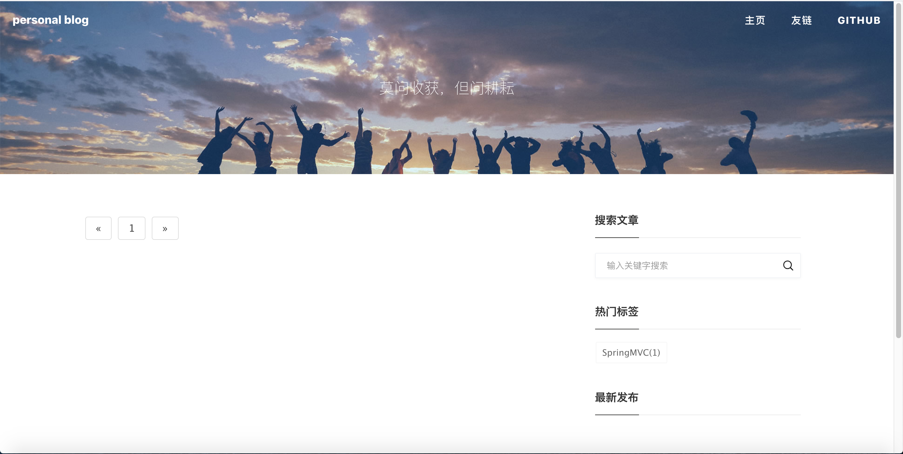
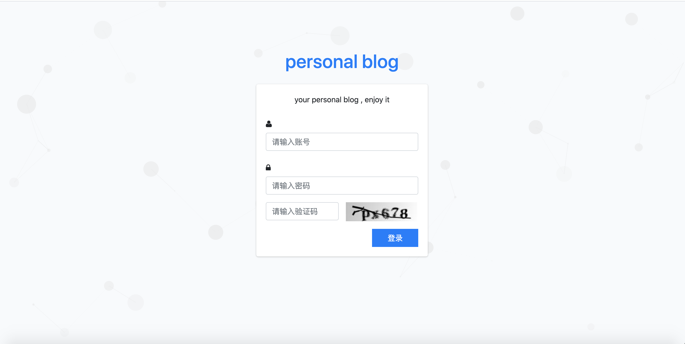
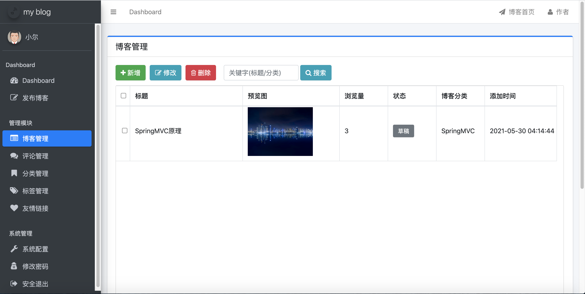
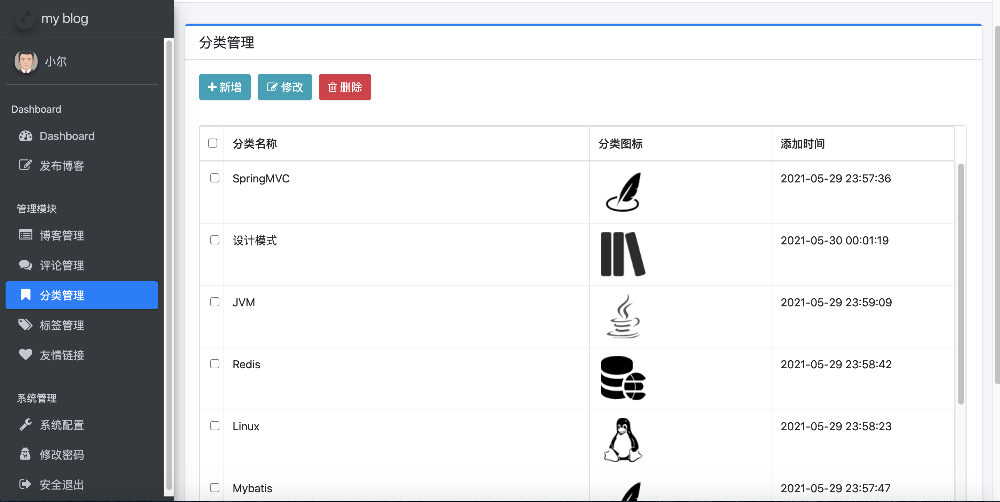
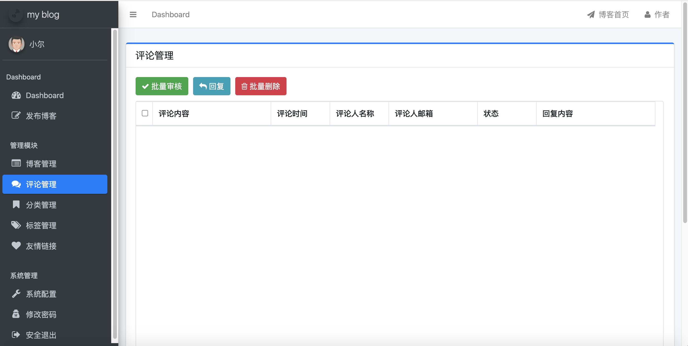
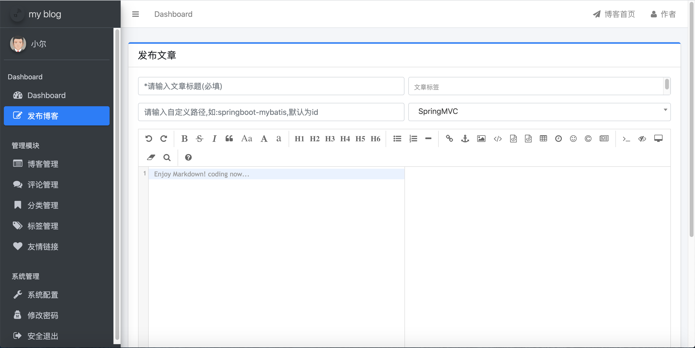

### personal blog

author: Mr.Er

email: exhere519@gmail.com

#### intro
本个人博客使用SpringBoot+Thymeleaf+MyBatis+MySQL搭建 B/S模式

#### including
博客浏览页面
后台管理页面

1. 博客浏览页面
    1. 博客浏览功能
    2. 博客评论功能
    3. 文章搜索功能
    4. 热门标签查看功能
    5. 查看最新博客功能
    6. 点击最多查看功能

2. 后台管理页面
    1. 数据统计功能
    2. 博客发布功能
    3. 博客管理功能
    4. 评论管理功能
    5. 分类管理功能
    6. 标签管理功能
    7. 友情链接功能
    8. 系统配置功能
    9. 修改密码功能
    10. 登录退出功能


#### dependencies

```spring-boot-starter-parent spring-boot-starter-web spring-boot-starter-thymeleaf spring-session-core```等

详见项目根目录 ./pom.xml
#### figs
项目运行图片
##### 博客浏览页面

##### 后台管理页面










